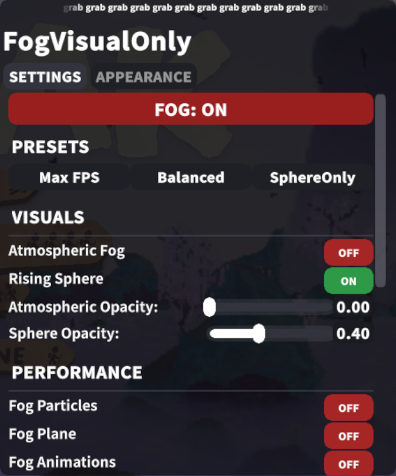
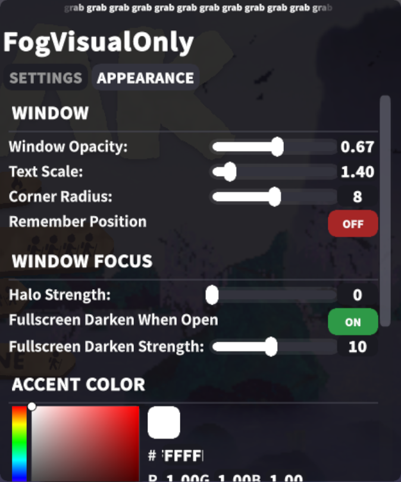
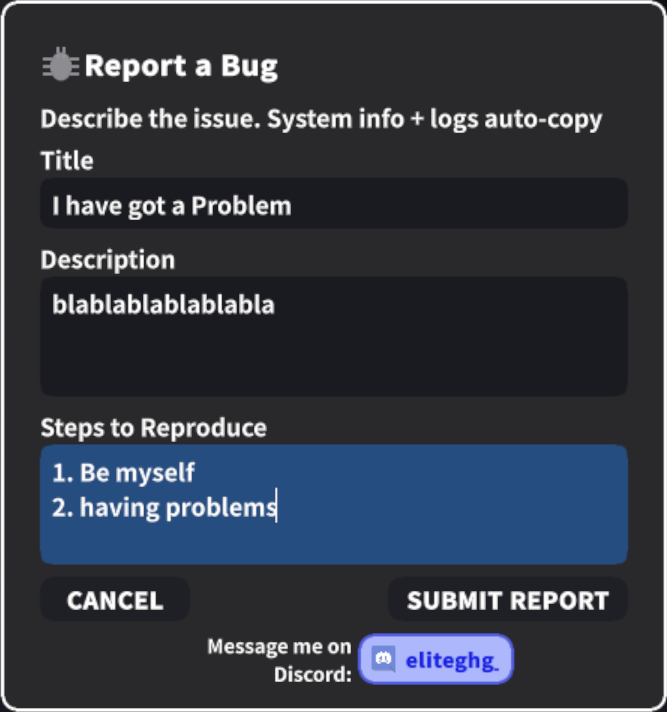

# FogVisualOnly

> Remove fog visuals for a **performance and visual boost** while keeping fog **deadliness** intact.

A BepInEx plugin for [PEAK](https://store.steampowered.com/app/2767250/PEAK/) that removes fog visuals for a PERFORMANCE and visual gain/advantage while preserving all fog ***deadliness*** (damage, healing, etc.). Fully safe with vanilla players online.

---

## Quick Start

1. Install [BepInEx for PEAK](https://thunderstore.io/c/peak/p/BepInEx/BepInExPack_PEAK/)
2. Download `FogVisualOnly.dll` from [Thunderstore](https://thunderstore.io/c/peak/p/eliteghg/FogVisualOnly/)
3. Copy to `BepInEx/plugins/`
4. Launch PEAK and press **F3** to open the menu

---

## Screenshots

**Settings Menu**

**Appearance Settings**

**Bug Report**

---

## How to Update

1. Download the latest `FogVisualOnly.dll` from [Thunderstore](https://thunderstore.io/c/peak/p/eliteghg/FogVisualOnly/)
2. **Overwrite** the old file in `BepInEx/plugins/`
3. Launch PEAK — your settings are saved automatically

---

## Menu Overview

### Fog Toggle

The big button at the top saves and restores all your settings:

> [!TIP]
> **FOG OFF** — fog is hidden, max FPS

> [!DANGER]
> **FOG ON** — fog is visible, vanilla look

Toggling back restores whatever settings you had before.

### Presets

| Preset | Description |
|--------|-------------|
| **Max FPS** | Everything off — fog, particles, sounds, animations, shadows, VFX all disabled. Max PERFORMANCE. |
| **Balanced** | Atmospheric fog removed, sphere at 40% opacity. Particles/shadows disabled. Good middle ground. |
| **SphereOnly** | Atmospheric fog removed, sphere fully visible with all effects disabled. For players who like the sphere `death` aesthetic. |

---

## Settings

### Fog Settings

| Setting | Description |
|---------|-------------|
| Atmospheric Fog | Toggle global fog visibility |
| Rising Sphere | Toggle the rising fog sphere |
| Atmospheric Opacity | Fog transparency (0–1) |
| Sphere Opacity | Sphere transparency (0–1) |
| Fog Particles | Disable particle systems |
| Fog Plane | Disable ground fog plane |
| Fog Animations | Disable fog movement |
| Fog Shadows | Disable fog shadow casting |
| Fog VFX | Disable visual effects |
| Sphere Shadows | Disable sphere shadow casting |
| Sphere Particles | Disable sphere particles |
| Sphere Animations | Disable sphere animations |
| Fog Sounds | Mute fog audio |
| Fog Colliders | Disable fog collision |

### Appearance Settings

| Setting | Description |
|---------|-------------|
| Window Opacity | Settings window transparency (0.3–1) |
| Text Scale | UI text size (1.3–2) |
| Corner Radius | Roundness of window and buttons (0–16) |
| Remember Position | Save window position between sessions |
| Halo Strength | Multi-layer glow behind the window (0–12) |
| Fullscreen Darken When Open | Dim the entire screen when menu is open |
| Fullscreen Darken Strength | How dark the screen gets (1–20) |
| Accent Color | HSV color picker with hex input and R/G/B fields |

---

## Compatibility

> [!WARNING]
> **Conflicts with** CoddingCat-FogRemover — disable it first

- ✅ **Safe with vanilla players** — only affects local visuals, fog damage/healing is unchanged
- ✅ **No material cloning** — uses MaterialPropertyBlock for zero-alteration rendering

---

## Bug Reports

Press **REPORT BUG** in the mod menu — it will copy your system info, mod version, and last 4000 lines of logs to clipboard (When SUBMITTING only) and opens GitHub Issues. Just paste and submit.

Or report directly: [GitHub Issues](https://github.com/YOURNAME/FogVisualOnly/issues)

Or message me on Discord: 

---

**Enjoying FogVisualOnly? Consider supporting me!**

 

